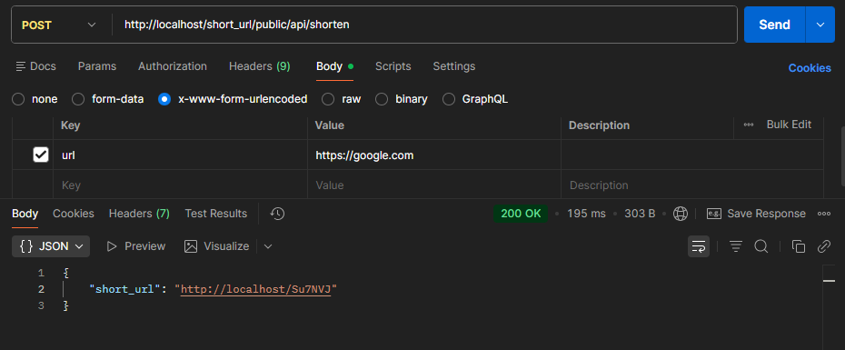
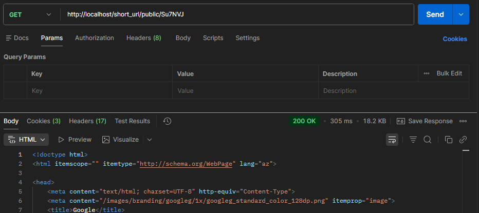
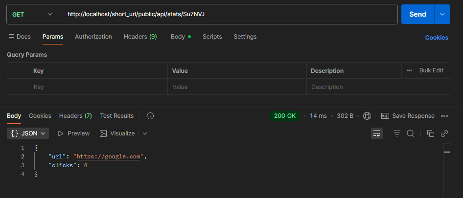

# PHP URL Shortener (Core PHP)

Sadə URL qısaltma sistemi. Core PHP ilə yazılıb, MVC strukturu və custom router istifadə olunub.

---

## 1️⃣ Create Short URL

### Endpoint

POST /api/shorten


### Təsvir
Verilən uzun URL-i qısaldır və unikal short code yaradır.

### Request (x-www-form-urlencoded)

url = https://google.com




### Response
```json
{
  "short_url": "http://localhost/short_url/public/Ab3kL9"
}

2️⃣ Redirect to Original URL
Endpoint
GET /{short_code}
Təsvir

Short code vasitəsilə istifadəçini original URL-ə yönləndirir və klik sayını 1 artırır.

Example
http://localhost/short_url/public/Ab3kL9
```


```
3️⃣ Get URL Statistics
Endpoint
GET /api/stats/{short_code}
Təsvir

Verilmiş short code üçün:

Original URL-i qaytarır

Click sayını göstərir

Example
GET /api/stats/Ab3kL9
Response
{
  "url": "https://google.com",
  "clicks": 5
}
```


